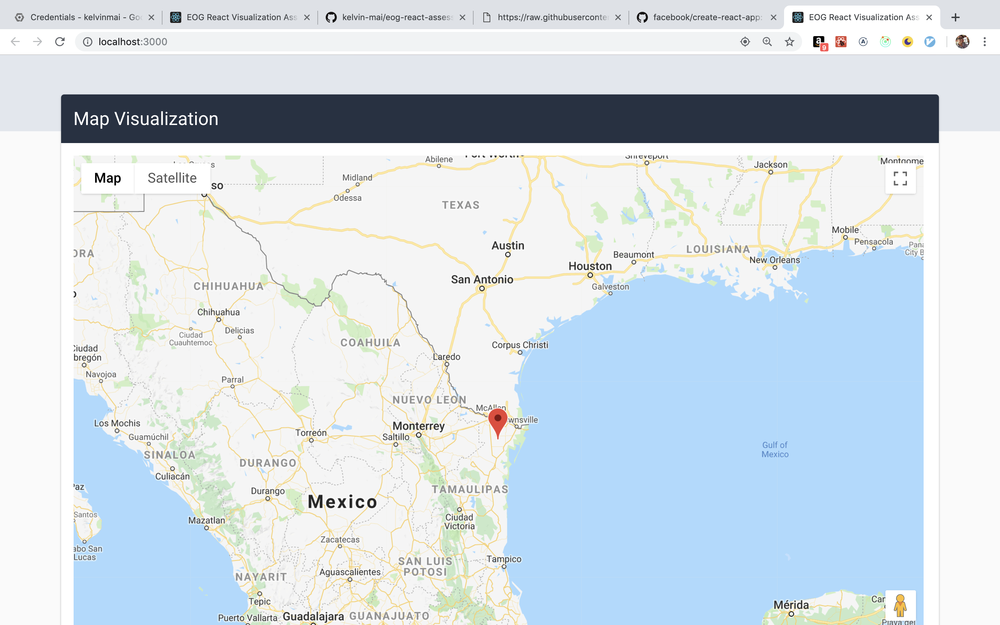

## Create React App Visualization

Read more about this assessment here

### Assessment

Your mission, dear developer, is to visualize the drones position and temperature as it circles the area around Houston. We have an API documented below that return the last 30 seconds of metrics -- we receive data every 4 seconds from the drone. For beginners (think Jr Devs), you can poll the API and display a dashboard view of the current metric data.

For mid to advanced devs, please create a visualization of either a map or a chart of the metric.

### Technologies Used

- [React](https://reactjs.org/) - JavaScript front end framework
- [Redux](https://redux.js.org/) - Javascript state management Library
- [Redux Sagas](https://redux-saga.js.org/) - Redux side effects library for asynchronous tasks
- [Chart.JS](https://www.chartjs.org/) - Javascript chart visualization library
- [Google Maps Javascript API](https://developers.google.com/maps/documentation/javascript/tutorial) - Javascript API for google maps

For a list of specific libraries and versions please look inside of the package.json. Project scaffold was created by EOG's version of [create-react-app](https://github.com/facebook/create-react-app).

#### Additional Notes

I tried to keep with the coding standards given to me by the project's initial scaffold, but preferred my personal standards when available. Two of which is the rampant use of nested object destructuring (which I know can confuse some developers), and organization of imports.

I also created a separate git branch with the entire project converted into [Typescript](https://github.com/kelvin-mai/eog-react-assessment/tree/typescript) for a better personal developer experience, but kept the modern javascript version on the master branch for a fair assessment.
